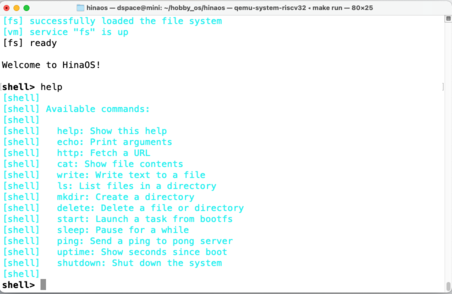

# HinaOS

HinaOS (ひなおーえす) はマイクロカーネルベースの教育用オペレーティングシステムです。次の特徴・機能を持っています。

- 32ビット RISC-V ([QEMU virtマシン](https://www.qemu.org/docs/master/system/riscv/virt.html)) に対応
- マルチプロセッサ対応マイクロカーネル
- 独自ファイルシステム (HinaFS)
- TCP/IP プロトコルスタック
- virtio-blk デバイスドライバ (仮想ストレージデバイス)
- virtio-net デバイスドライバ (仮想ネットワークデバイス)
- コマンドラインシェル

## 実行例

